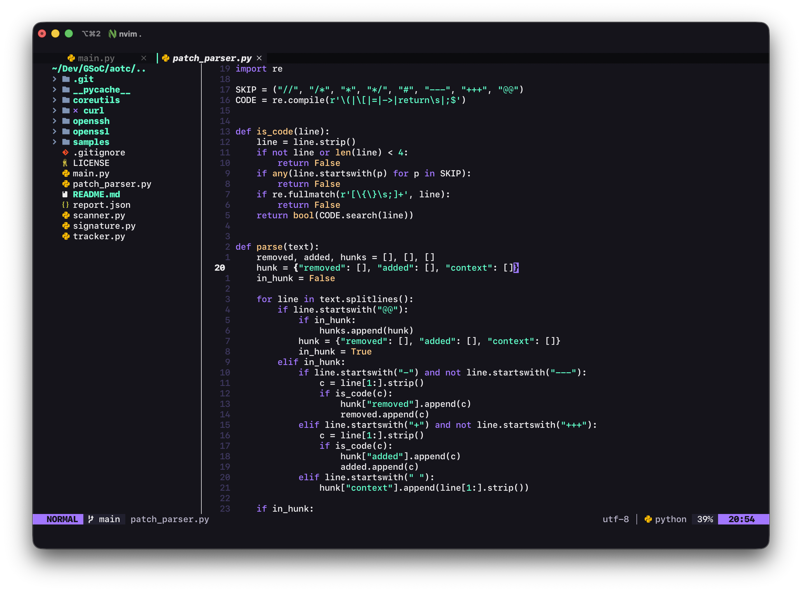

# Neovim Config
---

- Personal Neovim config
- uses Lazy for managing packages

## Plugins

- `bufferline`
- `lualine`
- `nvim-tree`
- `nvim-lspconfig`
- `aura-theme`
- `nvim-cmp`

## Keybinding Changes

- `<leader>e` -> :NvimTreeFocus
- `<leader>.` -> :bnext
- `<leader>,` -> :bprevious
- `<leader>x` -> :bdelete

## Screenshot

- Terminal: iTerm
- Colorscheme: Aura Theme
- Font: SFMono Nerd Font

---
